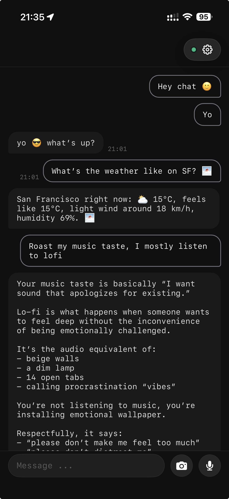
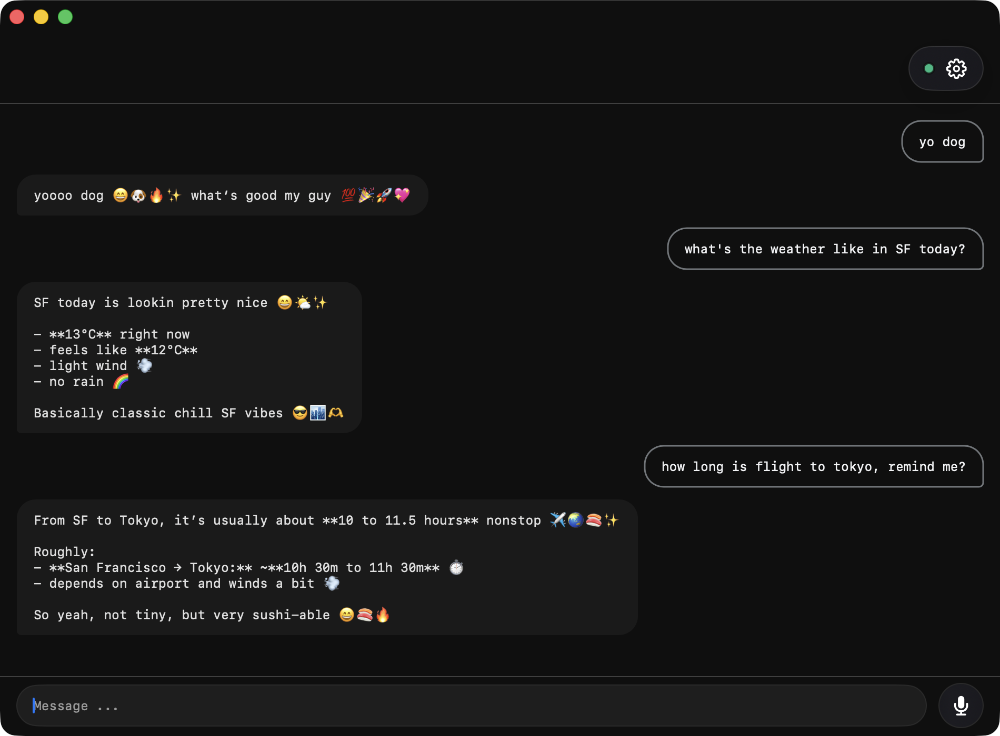

<div align="center">


# chat94

**Native iOS & macOS chat for your self-hosted [OpenClaw](https://github.com/openclaw/openclaw) agent.**
Beautiful. End-to-end encrypted. Zero-knowledge relay. No middleman reads a thing.

[chat94.com](https://chat94.com) · [@chat94official](https://t.me/chat94official) · contact@chat94.com

[](https://swift.org)
[](https://www.apple.com/ios)
[](https://www.apple.com/macos)
[](./LICENSE)
[](https://t.me/chat94official)

</div>

<div align="center">

<table>
<tr>
<td align="center" width="50%"><br/><sub><b>iPhone</b></sub></td>
<td align="center" width="50%"><br/><sub><b>Mac</b></sub></td>
</tr>
</table>

</div>

---

## ✨ What's inside

- 🔐 **End-to-end encrypted.** XChaCha20-Poly1305 against a shared 32-byte group key. The relay never sees plaintext.
- 📲 **Native everywhere.** SwiftUI on iOS 17+ and macOS 14+ Sonoma. Single codebase, two beautiful targets.
- 🤝 **Pairing-code onboarding.** 8-character code, single-use, X25519 + SHA-256 proof, encrypted group-key transfer.
- ⚡️ **Streamed replies.** Live token-by-token agent responses with cumulative `text_delta` handling.
- 🎙️ **Voice, image, text.** Voice messages with waveforms, in-app camera capture, plain text — all encrypted.
- 🔔 **Silent push wake.** APNs delivers a content-less ping; your device wakes, drains the queue, decrypts locally. Apple never sees your messages.
- 🛡️ **App Attest.** Group keys are gated by Apple's hardware-attested device check — no spammer can register a key from a script.
- 📊 **Privacy by default.** Sentry crash reports and PostHog analytics are opt-in via an in-app toggle. Off → nothing leaves the device.
- 🚦 **Version policy.** The relay can softly nag or hard-block outdated clients without disconnecting them.

---

## 🛠 Build

The project is generated from `chat94/project.yml` via [XcodeGen](https://github.com/yonaskolb/XcodeGen) — no `.xcodeproj` workspace state is committed.

```bash
brew install xcodegen
cd chat94
xcodegen generate
open chat94.xcodeproj
```

### 🎯 Targets

| Scheme | Bundle ID | Notes |
|---|---|---|
| `chat94iphonedev` | `com.neonnode.chat94app.dev` | 🧪 Dev iPhone — verbose logging, dev APNs/App Attest |
| `chat94iphoneprod` | `com.neonnode.chat94app` | Internal release |
| `chat94iphoneappstore` | `com.neonnode.chat94app` | 🏪 App Store distribution |
| `chat94mac` | `com.neonnode.chat94app` | 🖥️ macOS app |
| `chat94Tests` | — | ✅ Unit tests (Swift Testing) |

### 🔧 Command-line builds

```bash
# iOS simulator
xcodebuild -project chat94/chat94.xcodeproj \
  -scheme chat94iphoneprod \
  -sdk iphonesimulator \
  -destination 'platform=iOS Simulator,name=iPhone 17' \
  build

# macOS (no signing — local only)
xcodebuild -project chat94/chat94.xcodeproj \
  -scheme chat94mac \
  CODE_SIGNING_ALLOWED=NO build

# Tests
xcodebuild -project chat94/chat94.xcodeproj \
  -scheme chat94Tests \
  -sdk iphonesimulator \
  -destination 'platform=iOS Simulator,name=iPhone 17' \
  test
```

### 📦 DMG distribution

A signed, notarized macOS DMG is one command away:

```bash
chat94/scripts/build-dmg.sh                # full pipeline (sign + notarize + staple)
chat94/scripts/build-dmg.sh --no-notarize  # quick local DMG, skip Apple round-trip
```

Output lands in `chat94/build/dist/chat94-<version>.dmg`. The script's pre-flight checks tell you exactly what's missing if it can't run yet (Developer ID cert, notary keychain profile, `create-dmg`).

### 🔑 Optional dev config

Telemetry keys live in `chat94/Resources/dev-config.json` (gitignored). Without it, Sentry and PostHog stay quiet:

```json
{
  "sentryDsn": "...",
  "posthogApiKey": "...",
  "posthogHost": "https://us.i.posthog.com",
  "posthogSessionReplayEnabled": false
}
```

---

## 🗂 Project layout

```
chat94/
├── 📋 project.yml                 XcodeGen spec
├── Sources/
│   ├── 🚀 App/                    Entry point, app delegate, intents
│   ├── 📡 Gateway/                Relay client, wire types, codecs
│   ├── 📦 Models/                 SwiftData + value types
│   ├── ⚙️  Services/              Crypto, App Attest, push, telemetry, pairing, …
│   └── 🎨 Views/                  SwiftUI screens, Theme, Components
├── 🎒 Resources/                  Assets, Info.plist, entitlements
└── 🧪 Tests/                      Crypto, protocol, pairing, version-policy tests

docs/
├── 🏗  architecture.md            Runtime model, data flow, components
├── 🌐 protocol.md                 Relay wire protocol (pairing + session)
├── 📘 product.md                  Feature spec
├── 🌊 streaming.md                text_delta / status semantics for clients
├── ✅ status.md                   Implementation status tracker
└── 🔮 FUTURE.md                   Deferred features
```

📖 **Where to start in the docs:**
- New here? → [`docs/architecture.md`](./docs/architecture.md) — runtime model, who calls what.
- Implementing the relay or a new client? → [`docs/protocol.md`](./docs/protocol.md) — the wire contract.
- Streaming behaving weirdly? → [`docs/streaming.md`](./docs/streaming.md) — the gotchas.

---

## 🧬 Related repos

- 🦀 **Relay** — Rust WebSocket relay (separate repo)
- 🔌 **OpenClaw plugin** — TypeScript bridge between OpenClaw agents and the relay (separate repo)

---

## 🤝 Contributing

PRs welcome. You'll need to sign a CLA — see [CONTRIBUTING.md](./CONTRIBUTING.md). Reach the team on [chat94.com](https://chat94.com), email at contact@chat94.com, or Telegram at [@chat94official](https://t.me/chat94official) — we usually reply within a day.

---

## 📜 License

chat94 is licensed under the **GNU General Public License v3.0** (GPL-3.0). See [LICENSE](./LICENSE).

Copyright © 2026 NeonNode Limited. All rights reserved.

**Commercial licensing:** Want to use chat94 in a way GPL-3.0 doesn't allow (e.g. proprietary/closed-source use)? Reach out at contact@chat94.com.

---

<div align="center">

Made with ☕ by [NeonNode](https://chat94.com)

</div>
